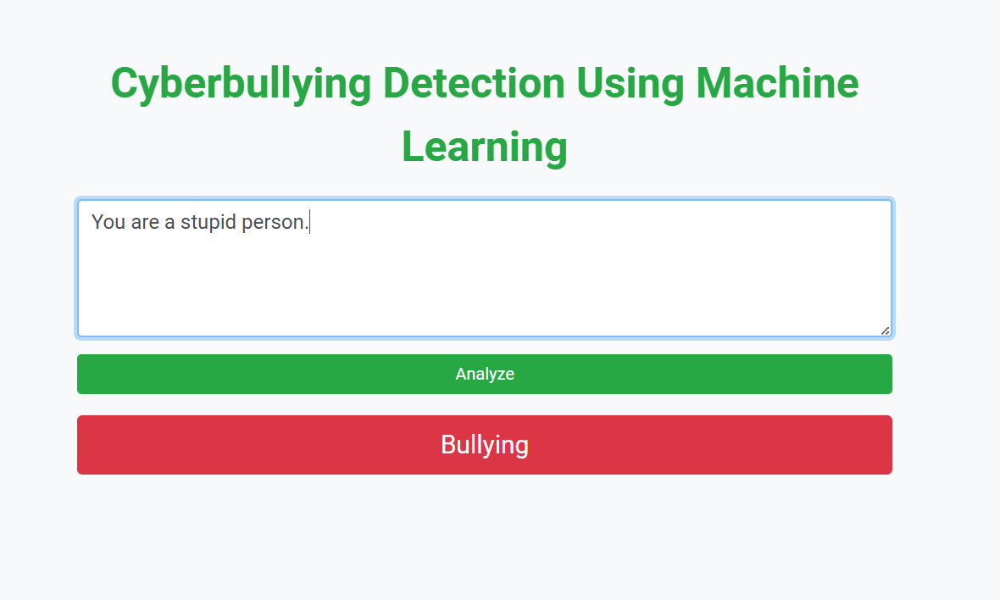
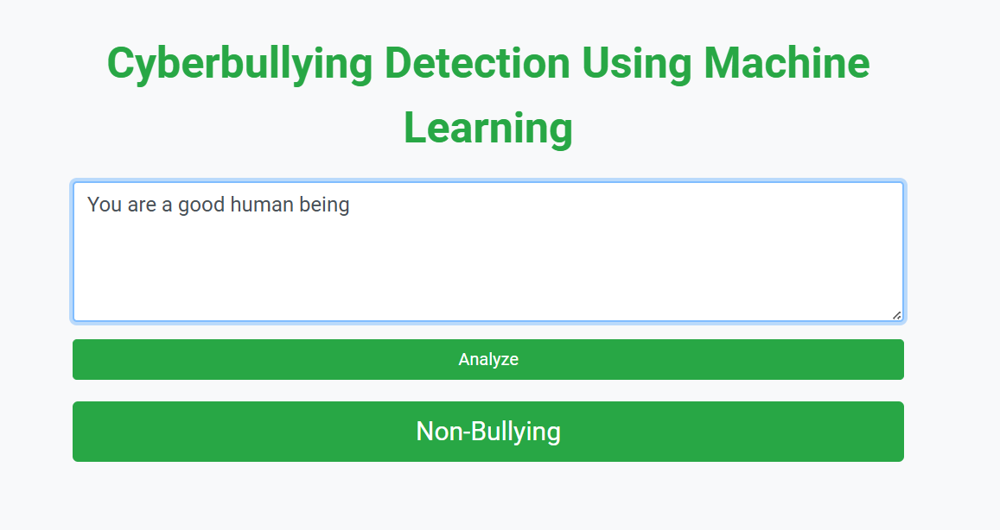
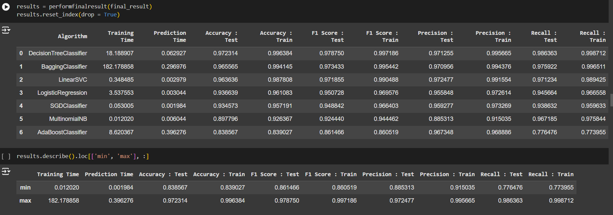

# Cyberbullying Detection Using Python & Machine Learning

The Cyberbullying Detection System leverages advanced machine learning and natural language processing (NLP) techniques to identify harmful or offensive content online.

## About the Model

- Developed a cyberbullying detection system using machine learning algorithms \textbf{to identify offensive, abusive, and harmful language} in social media content.
- Collected and preprocessed over \textbf{15,000+} publicly available social media posts from Twitter, Reddit, and Facebook to create a labeled dataset for model training.
- Achieved an \textbf{accuracy of 97.2\% }using a Decision Tree Classifier, showcasing the system's reliability in detecting cyberbullying.

## 📷 Model Screenshots
### 1

### 2

### 3

### 🤝 Connect with me:

Feel free to connect with me 
rajatkumar020304@gmail.com

